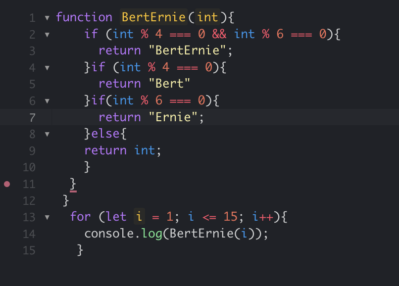

For the "Workout of the Day" on Wednesday August 30th, we were assigned a relatively easy task, to find multiples of specific integers and return "Bert", "Ernie", or "BertErnie". I was confident in my four if statemets and two for loops, but after I turned it in, I looked at my neighboors solution, which was much less redundant than mine. I realized that although my solution was correct, her solution was much more efficient. Reflecting on this experience, I am realizing in the future I need to rush less on these WODs, and take my time to think through these redundancies. 

My modified, more efficient solution is provided below.

