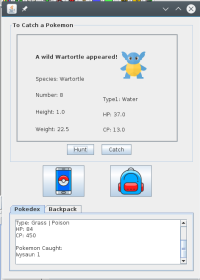

This project was done during my participation in Kapiʻolani Community Colleges ICS 212 class taught by Prof. Lisa Miller, in junction with two other classmates. We made a java page for each pokemon, each type, a page for the tree, node, and both the node exceptions and pokemon exceptions. Included in the GUI and perhaps most difficult for me, was the creation of the user interface in the frame and panel pages. 
