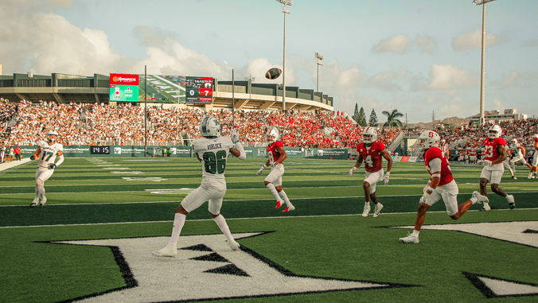

Due to the upcoming Stanford UH game, the Network Operations department set up a separate network specifically for the UH-Stanford game attendees. For this, a completely new IP was created, connecting off of the HECO fioptic cables. We had to set up Access points, switches, and routers that addressed this new network. This was a little redundant, as there are already multiple access points set up for the crowd. 

Although redundant, this accommodation was necessary in order to provide internet access to the 9,000 to 15,000 attendees, as well as services that televise, stream radio and other audio, and provide live statistics about the game. 
